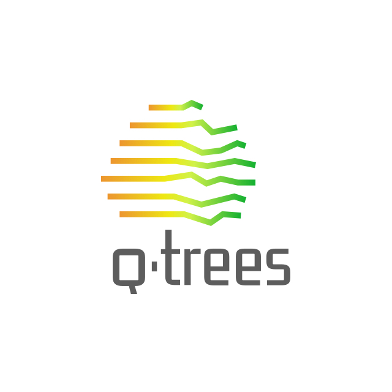

# QTrees

This repository is related to **Quantified Trees** – a project funded by the Federal Ministry for the Environment, Nature Conservation and Nuclear Safety of Germany

## How to use

In order to keep track the ongoing exploration and findings, this Repo contains a [Wiki](https://github.com/technologiestiftung/qtrees-ai-data/wiki).
The Wiki should be used for documentation purpose so that even external persons are able to follow our work process.

To agree with GitHub's language conventions, we suggest to communication in **English**

## More coming soon...
